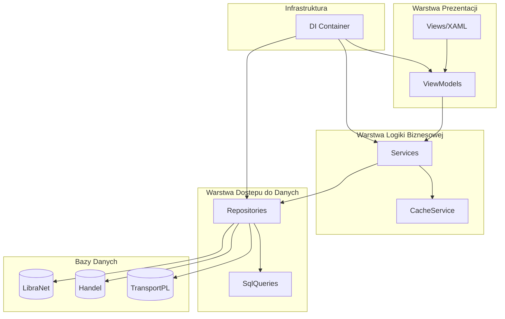
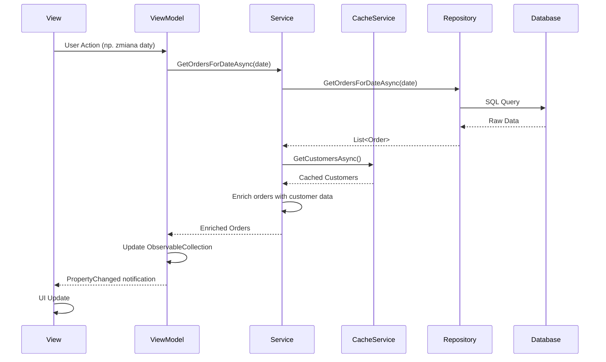

# ZPSP.Sales - Dokumentacja Architektury

## Przeglad

Modul sprzedazy ZPSP wykorzystuje warstwowa architekture oparta o wzorzec MVVM (Model-View-ViewModel) z dodatkowymi warstwami Services i Repositories.

## Diagram Architektury



## Warstwy Aplikacji

### 1. Warstwa Prezentacji (Views)

**Odpowiedzialnosc:** Wyswietlanie danych i obsluga interakcji uzytkownika.

- Czyste XAML bez logiki biznesowej w code-behind
- Data binding do ViewModeli
- Komendy (ICommand) zamiast event handlerów

**Pliki:**
- `Views/MainWindow.xaml` - glowne okno zamowien
- `Views/Controls/` - kontrolki wielokrotnego uzytku

### 2. Warstwa ViewModel

**Odpowiedzialnosc:** Logika prezentacji, stan widoku, transformacja danych do wyswietlenia.

**Klasa bazowa: `BaseViewModel`**
```csharp
public abstract class BaseViewModel : INotifyPropertyChanged, IDisposable
{
    // Stan ladowania
    public bool IsLoading { get; set; }
    public string LoadingMessage { get; set; }

    // Obsluga bledow
    public string ErrorMessage { get; set; }
    public bool HasError { get; }

    // Pomocnicze metody
    protected Task ExecuteAsync(Func<Task> action, string loadingMessage);
    protected bool SetProperty<T>(ref T field, T value);
}
```

**Glowny ViewModel:**
- `MainViewModel` - zarzadza lista zamowien, filtrami, agregacjami

### 3. Warstwa Services

**Odpowiedzialnosc:** Logika biznesowa, orkiestracja repozytoriow, walidacja.

**Serwisy:**

| Serwis | Odpowiedzialnosc |
|--------|------------------|
| `OrderService` | CRUD zamowien, walidacja, historia zmian |
| `ProductService` | Agregacje, bilansowanie, konfiguracja |
| `CacheService` | Centralne cachowanie danych |

**Wzorzec:**
```csharp
public class OrderService : IOrderService
{
    private readonly IOrderRepository _orderRepository;
    private readonly ICacheService _cacheService;

    public async Task<IEnumerable<Order>> GetOrdersForDateAsync(DateTime date)
    {
        var orders = await _orderRepository.GetOrdersForDateAsync(date);
        // Wzbogacenie o dane z cache
        var customers = await _cacheService.GetCustomersAsync();
        // Logika biznesowa...
        return enrichedOrders;
    }
}
```

### 4. Warstwa Repositories

**Odpowiedzialnosc:** Dostep do baz danych, mapowanie danych.

**Klasa bazowa: `BaseRepository`**
```csharp
public abstract class BaseRepository
{
    protected async Task<List<T>> QueryAsync<T>(string sql, object parameters, Func<IDataReader, T> mapper);
    protected async Task<T> ExecuteScalarAsync<T>(string sql, object parameters);
    protected async Task<int> ExecuteAsync(string sql, object parameters);
}
```

**Repozytoria:**

| Repozytorium | Baza | Tabele |
|--------------|------|--------|
| `OrderRepository` | LibraNet | ZamowieniaMieso, ZamowieniaMiesoTowar |
| `ProductRepository` | Handel + LibraNet | TW, KonfiguracjaProdukty, StanyMagazynowe |
| `CustomerRepository` | Handel | STContractors, ContractorClassification |
| `TransportRepository` | TransportPL | Kurs, Ladunek, Kierowca, Pojazd |

## Przepływ Danych



## Strategia Cachowania

### Typy Cache

1. **Statyczny (dlugi TTL):**
   - Kontrahenci - 30 minut
   - Produkty - 60 minut
   - Uzytkownicy - 60 minut

2. **Dynamiczny (per data):**
   - Wydania - 5 minut
   - Przychody - 5 minut

### Implementacja

```csharp
public class CacheService : ICacheService
{
    // Thread-safe cache
    private readonly ConcurrentDictionary<DateTime, Dictionary<int, decimal>> _releasesCache;

    // Synchronizacja ladowania
    private readonly SemaphoreSlim _customersSemaphore = new(1, 1);

    public async Task<IDictionary<int, decimal>> GetReleasesAsync(DateTime date, bool forceRefresh = false)
    {
        if (!forceRefresh && _releasesCache.TryGetValue(date.Date, out var cached))
            return cached;

        // Load from database...
    }
}
```

## Obsluga Bledow

### Warstwy bledow

1. **Repository** - rzuca wyjatki przy bledach DB
2. **Service** - loguje i przekazuje lub opakowuje wyjatki
3. **ViewModel** - lapie wyjatki, ustawia `ErrorMessage`
4. **View** - wyswietla bledy uzytkownikowi

### Wzorzec w ViewModel

```csharp
protected async Task ExecuteAsync(Func<Task> action, string loadingMessage, bool showError = true)
{
    try
    {
        IsLoading = true;
        LoadingMessage = loadingMessage;
        ClearError();

        await action();

        LastUpdated = DateTime.Now;
    }
    catch (Exception ex)
    {
        ErrorMessage = ex.Message;
        Debug.WriteLine($"[{GetType().Name}] Error: {ex}");

        if (showError)
            MessageBox.Show($"Blad: {ex.Message}", "Blad", ...);
    }
    finally
    {
        IsLoading = false;
    }
}
```

## Dependency Injection

### Konfiguracja

```csharp
public static class ServiceConfiguration
{
    public static IServiceCollection AddSalesModule(this IServiceCollection services)
    {
        // Repositories - Scoped
        services.AddScoped<IOrderRepository, OrderRepository>();
        services.AddScoped<IProductRepository, ProductRepository>();
        services.AddScoped<ICustomerRepository, CustomerRepository>();
        services.AddScoped<ITransportRepository, TransportRepository>();

        // Services - Scoped
        services.AddScoped<IOrderService, OrderService>();
        services.AddScoped<IProductService, ProductService>();

        // Cache - Singleton
        services.AddSingleton<ICacheService, CacheService>();

        return services;
    }
}
```

### Lifetimes

| Typ | Lifetime | Uzasadnienie |
|-----|----------|--------------|
| Repositories | Scoped | Per okno/request, nowe polaczenie DB |
| Services | Scoped | Zalezy od Repositories |
| CacheService | Singleton | Wspoldzielony cache dla wszystkich okien |
| ViewModels | Transient | Per okno |

## Wzorce Projektowe

### 1. Repository Pattern
Abstrakcja dostepu do danych, umozliwia testowanie i zmiane implementacji.

### 2. Unit of Work
Repozytoria zarzadzaja wlasnymi transakcjami przez `SqlTransaction`.

### 3. Command Pattern
`RelayCommand` i `AsyncRelayCommand` dla akcji w UI.

### 4. Observer Pattern
`INotifyPropertyChanged` dla data bindingu.

### 5. Factory Pattern
`ServiceConfiguration.CreateServiceProvider()` tworzy kontener DI.

### 6. Singleton Pattern
`DatabaseConnections.Instance` i `CacheService` jako singleton.

## Optymalizacje

### Batch Loading (N+1 Problem)

**Przed:**
```csharp
foreach (var order in orders)
{
    order.Items = await GetItemsAsync(order.Id); // N zapytan!
}
```

**Po:**
```csharp
var allItems = await GetItemsBatchAsync(orderIds); // 1 zapytanie
var itemsByOrder = allItems.GroupBy(i => i.OrderId).ToDictionary(...);
foreach (var order in orders)
{
    order.Items = itemsByOrder.GetValueOrDefault(order.Id, new List<OrderItem>());
}
```

### Agregacje w SQL

**Przed (C#):**
```csharp
var sum = orders.SelectMany(o => o.Items).Sum(i => i.Ilosc);
```

**Po (SQL):**
```sql
SELECT SUM(t.Ilosc) FROM ZamowieniaMiesoTowar t
JOIN ZamowieniaMieso z ON t.ZamowienieId = z.Id
WHERE z.DataUboju = @Day
```

## Bezpieczenstwo

### SQL Injection Prevention
Wszystkie zapytania sa parametryzowane:
```csharp
cmd.Parameters.AddWithValue("@Day", date);
// NIGDY: $"WHERE Data = '{date}'"
```

### Walidacja danych wejsciowych
```csharp
public async Task<int> CreateOrderAsync(Order order, string userId)
{
    if (order.KlientId <= 0)
        throw new ArgumentException("Wymagany ID klienta");
    // ...
}
```
