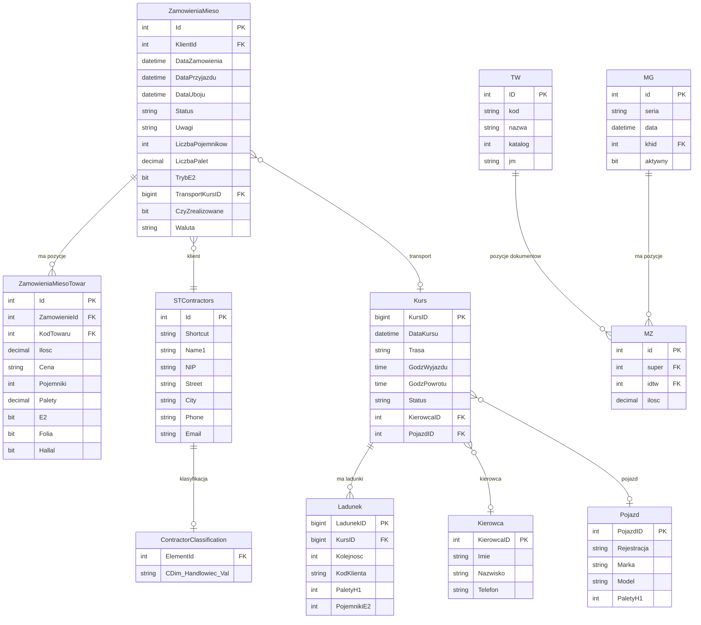

# ZPSP.Sales - Dokumentacja Bazy Danych

## Przeglad Baz Danych

System ZPSP korzysta z trzech baz danych:

| Baza | Serwer | Przeznaczenie |
|------|--------|---------------|
| **LibraNet** | 192.168.0.109 | Glowna baza operacyjna (zamowienia, konfiguracja) |
| **Handel** | 192.168.0.112 | Sage Symfonia ERP (kontrahenci, faktury, WZ) |
| **TransportPL** | 192.168.0.109 | Logistyka (kursy, kierowcy, pojazdy) |

## Diagram ERD



## LibraNet - Tabele Glowne

### dbo.ZamowieniaMieso
Glowna tabela zamowien miesa.

| Kolumna | Typ | Opis |
|---------|-----|------|
| Id | int | PK, identyfikator zamowienia |
| KlientId | int | FK do Handel.STContractors |
| DataZamowienia | datetime | Data zlozenia zamowienia |
| DataPrzyjazdu | datetime | Planowana data i godzina odbioru |
| DataUboju | date | Data produkcji (uboju) |
| Status | varchar(50) | Nowe, Zrealizowane, Anulowane |
| Uwagi | nvarchar(max) | Notatki do zamowienia |
| LiczbaPojemnikow | int | Liczba pojemnikow E2 |
| LiczbaPalet | decimal(18,2) | Liczba palet H1 |
| TrybE2 | bit | 1=E2 (40 szt/paleta), 0=STD (36) |
| TransportKursID | bigint | FK do TransportPL.Kurs |
| CzyZrealizowane | bit | Czy zamowienie wydane |
| DataWydania | datetime | Data wydania WZ |
| Waluta | varchar(3) | PLN, EUR |
| AnulowanePrzez | varchar(50) | ID uzytkownika anulujacego |
| DataAnulowania | datetime | Data anulowania |
| IdUser | varchar(50) | ID uzytkownika tworzacego |
| DataUtworzenia | datetime | Data utworzenia |

**Indeksy:**
```sql
CREATE INDEX IX_ZamowieniaMieso_DataUboju
ON ZamowieniaMieso(DataUboju)
INCLUDE (KlientId, Status);

CREATE INDEX IX_ZamowieniaMieso_KlientId
ON ZamowieniaMieso(KlientId);
```

### dbo.ZamowieniaMiesoTowar
Pozycje zamowien.

| Kolumna | Typ | Opis |
|---------|-----|------|
| Id | int | PK |
| ZamowienieId | int | FK do ZamowieniaMieso |
| KodTowaru | int | FK do Handel.TW.ID |
| Ilosc | decimal(18,2) | Ilosc w kg |
| Cena | varchar(50) | Cena jednostkowa (string!) |
| Pojemniki | int | Liczba pojemnikow dla pozycji |
| Palety | decimal(18,2) | Liczba palet dla pozycji |
| E2 | bit | Czy pojemniki E2 |
| Folia | bit | Czy pakowane w folie |
| Hallal | bit | Czy produkt halal |

**Indeksy:**
```sql
CREATE INDEX IX_ZamowieniaMiesoTowar_ZamowienieId
ON ZamowieniaMiesoTowar(ZamowienieId);

CREATE INDEX IX_ZamowieniaMiesoTowar_KodTowaru
ON ZamowieniaMiesoTowar(KodTowaru)
INCLUDE (Ilosc);
```

### dbo.KonfiguracjaProdukty
Konfiguracja udzialow produktow w puli Kurczaka B.

| Kolumna | Typ | Opis |
|---------|-----|------|
| Id | int | PK |
| ProduktId | int | FK do Handel.TW.ID |
| ProcentUdzialu | decimal(5,2) | Procent udzialu w puli |
| GrupaScalania | varchar(100) | Nazwa grupy do scalania |
| Kolejnosc | int | Kolejnosc wyswietlania |
| DataOd | date | Data poczatku obowiazywania |
| DataDo | date | Data konca (NULL = aktualny) |

### dbo.KonfiguracjaWydajnosc
Konfiguracja wspolczynnikow wydajnosci.

| Kolumna | Typ | Opis |
|---------|-----|------|
| Id | int | PK |
| Wspolczynnik | decimal(5,2) | Wspolczynnik wydajnosci (%) |
| ProcentA | decimal(5,2) | Procent Kurczaka A |
| ProcentB | decimal(5,2) | Procent Kurczaka B |
| DataOd | date | Data poczatku |
| DataDo | date | Data konca |

### dbo.StanyMagazynowe
Stany magazynowe per produkt per dzien.

| Kolumna | Typ | Opis |
|---------|-----|------|
| Id | int | PK |
| ProduktId | int | FK do Handel.TW.ID |
| Data | date | Data stanu |
| Stan | decimal(18,2) | Stan w kg |

### dbo.HistoriaZmianZamowien
Historia zmian w zamowieniach.

| Kolumna | Typ | Opis |
|---------|-----|------|
| Id | int | PK |
| ZamowienieId | int | FK do ZamowieniaMieso |
| DataZmiany | datetime | Data i czas zmiany |
| TypZmiany | varchar(50) | UTWORZENIE, EDYCJA, ANULOWANIE |
| PoleZmienione | varchar(100) | Nazwa zmienionego pola |
| WartoscPoprzednia | nvarchar(max) | Wartosc przed zmiana |
| WartoscNowa | nvarchar(max) | Wartosc po zmianie |
| Uzytkownik | varchar(50) | ID uzytkownika |
| UzytkownikNazwa | varchar(100) | Nazwa uzytkownika |
| OpisZmiany | nvarchar(max) | Dodatkowy opis |

## Handel (Sage Symfonia) - Tabele

### [SSCommon].[STContractors]
Kontrahenci.

| Kolumna | Typ | Opis |
|---------|-----|------|
| Id | int | PK |
| Shortcut | varchar(50) | Skrocona nazwa |
| Name1 | varchar(200) | Pelna nazwa |
| NIP | varchar(20) | NIP |
| Street | varchar(100) | Ulica |
| City | varchar(50) | Miasto |
| PostalCode | varchar(10) | Kod pocztowy |
| Phone | varchar(50) | Telefon |
| Email | varchar(100) | Email |

### [SSCommon].[ContractorClassification]
Wymiary kontrahenta (handlowiec, region, itp.).

| Kolumna | Typ | Opis |
|---------|-----|------|
| ElementId | int | FK do STContractors |
| CDim_Handlowiec_Val | varchar(50) | Przypisany handlowiec |

### [HM].[TW]
Towary (produkty).

| Kolumna | Typ | Opis |
|---------|-----|------|
| ID | int | PK |
| kod | varchar(100) | Kod towaru (nazwa) |
| nazwa | varchar(200) | Pelna nazwa |
| katalog | int | ID katalogu (67095=A, 67153=B) |
| jm | varchar(10) | Jednostka miary |

### [HM].[MG]
Naglowki dokumentow magazynowych.

| Kolumna | Typ | Opis |
|---------|-----|------|
| id | int | PK |
| seria | varchar(10) | Seria dokumentu (sWZ, PWP, itp.) |
| data | date | Data dokumentu |
| khid | int | FK do kontrahenta |
| aktywny | bit | Czy aktywny |

**Serie dokumentow:**
- `sWZ`, `sWZ-W` - Wydania zewnetrzne
- `sPWP`, `PWP` - Przychody wewnetrzne produkcji

### [HM].[MZ]
Pozycje dokumentow magazynowych.

| Kolumna | Typ | Opis |
|---------|-----|------|
| id | int | PK |
| super | int | FK do MG.id |
| idtw | int | FK do TW.ID |
| ilosc | decimal | Ilosc (ujemna dla wydan) |

## TransportPL - Tabele

### dbo.Kurs
Kursy transportowe.

| Kolumna | Typ | Opis |
|---------|-----|------|
| KursID | bigint | PK |
| DataKursu | date | Data kursu |
| Trasa | varchar(100) | Nazwa trasy |
| GodzWyjazdu | time | Godzina wyjazdu |
| GodzPowrotu | time | Godzina powrotu |
| Status | varchar(50) | Status kursu |
| KierowcaID | int | FK do Kierowca |
| PojazdID | int | FK do Pojazd |
| Uwagi | nvarchar(max) | Uwagi |

### dbo.Ladunek
Ladunki na kursach.

| Kolumna | Typ | Opis |
|---------|-----|------|
| LadunekID | bigint | PK |
| KursID | bigint | FK do Kurs |
| Kolejnosc | int | Kolejnosc dostawy |
| KodKlienta | varchar(50) | Kod klienta lub ZAM_xxx |
| PaletyH1 | int | Liczba palet |
| PojemnikiE2 | int | Liczba pojemnikow |
| Uwagi | nvarchar(max) | Uwagi |

### dbo.Kierowca
Kierowcy.

| Kolumna | Typ | Opis |
|---------|-----|------|
| KierowcaID | int | PK |
| Imie | varchar(50) | Imie |
| Nazwisko | varchar(50) | Nazwisko |
| Telefon | varchar(20) | Telefon |

### dbo.Pojazd
Pojazdy.

| Kolumna | Typ | Opis |
|---------|-----|------|
| PojazdID | int | PK |
| Rejestracja | varchar(20) | Numer rejestracyjny |
| Marka | varchar(50) | Marka |
| Model | varchar(50) | Model |
| PaletyH1 | int | Max palet H1 |

## Widoki SQL

### vw_DailyOrderSummary
Podsumowanie zamowien na dzien.

```sql
CREATE VIEW vw_DailyOrderSummary AS
SELECT
    z.DataUboju,
    COUNT(DISTINCT z.Id) AS LiczbaZamowien,
    COUNT(DISTINCT z.KlientId) AS LiczbaKlientow,
    SUM(t.Ilosc) AS SumaKg,
    SUM(z.LiczbaPalet) AS SumaPalet
FROM dbo.ZamowieniaMieso z
LEFT JOIN dbo.ZamowieniaMiesoTowar t ON z.Id = t.ZamowienieId
WHERE z.Status <> 'Anulowane'
GROUP BY z.DataUboju;
```

### vw_ProductAggregation
Agregacja produktow na dzien.

```sql
CREATE VIEW vw_ProductAggregation AS
SELECT
    z.DataUboju,
    t.KodTowaru,
    SUM(t.Ilosc) AS SumaZamowien,
    COUNT(DISTINCT z.KlientId) AS LiczbaKlientow
FROM dbo.ZamowieniaMieso z
JOIN dbo.ZamowieniaMiesoTowar t ON z.Id = t.ZamowienieId
WHERE z.Status <> 'Anulowane'
GROUP BY z.DataUboju, t.KodTowaru;
```

## Proponowane Indeksy

```sql
-- Dla filtrowania zamowien po dacie
CREATE INDEX IX_ZamowieniaMieso_DataUboju
ON dbo.ZamowieniaMieso(DataUboju)
INCLUDE (KlientId, Status, LiczbaPalet);

-- Dla agregacji produktow
CREATE INDEX IX_ZamowieniaMiesoTowar_KodTowaru
ON dbo.ZamowieniaMiesoTowar(KodTowaru)
INCLUDE (Ilosc, ZamowienieId);

-- Dla wydań
CREATE INDEX IX_MG_data_seria
ON [HM].[MG](data, seria)
WHERE aktywny = 1;

-- Dla transportu
CREATE INDEX IX_Kurs_DataKursu
ON dbo.Kurs(DataKursu);

-- Dla ladunkow
CREATE INDEX IX_Ladunek_KursID
ON dbo.Ladunek(KursID);
```

## Procedury Skladowane

### sp_GetOrdersForDate
Pobiera zamowienia z wzbogaceniem.

```sql
CREATE PROCEDURE sp_GetOrdersForDate
    @Day DATE
AS
BEGIN
    SET NOCOUNT ON;

    SELECT
        zm.Id,
        zm.KlientId,
        c.Shortcut AS Odbiorca,
        cc.CDim_Handlowiec_Val AS Handlowiec,
        SUM(ISNULL(zmt.Ilosc, 0)) AS Ilosc,
        zm.DataPrzyjazdu,
        zm.Status,
        zm.Uwagi
    FROM dbo.ZamowieniaMieso zm
    LEFT JOIN dbo.ZamowieniaMiesoTowar zmt ON zm.Id = zmt.ZamowienieId
    LEFT JOIN [HANDEL].[SSCommon].[STContractors] c ON zm.KlientId = c.Id
    LEFT JOIN [HANDEL].[SSCommon].[ContractorClassification] cc ON c.Id = cc.ElementId
    WHERE zm.DataUboju = @Day
    GROUP BY zm.Id, zm.KlientId, c.Shortcut, cc.CDim_Handlowiec_Val,
             zm.DataPrzyjazdu, zm.Status, zm.Uwagi
    ORDER BY zm.Id;
END;
```

## Mapowanie Baz Danych

| Encja | LibraNet | Handel | TransportPL |
|-------|----------|--------|-------------|
| Zamowienie | ZamowieniaMieso | - | - |
| Pozycja zamowienia | ZamowieniaMiesoTowar | - | - |
| Kontrahent | - | STContractors | - |
| Produkt | - | TW | - |
| Wydanie WZ | - | MG + MZ (sWZ) | - |
| Przychod PWP | - | MG + MZ (PWP) | - |
| Kurs transportowy | - | - | Kurs |
| Ladunek | - | - | Ladunek |
| Konfiguracja produktow | KonfiguracjaProdukty | - | - |
| Stany magazynowe | StanyMagazynowe | - | - |
| Historia zmian | HistoriaZmianZamowien | - | - |
